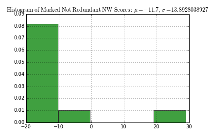
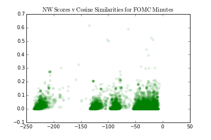
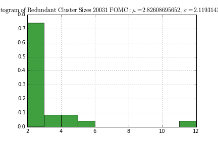

<h1 style="font-size: 32px">Redundancy in Government Documents</h1>

Aimee Barciauskas &nbsp; | &nbsp; aimee.barciauskas@barcelonagse.eu   &nbsp; | &nbsp; 2016 June 27

**Table of Contents**

[toc]

# Abstract

E-government initiatives offer unprecedented transparency into government proceedings. However, gaining understanding of a large corpus is often unmanageable for the average citizen. Further, heavy use of "administrative jargon" makes individual texts hard to digest. Exploiting and exploring redundancy in these texts may facilitate summarization, insights and visualization.


# Introduction

## Redundancy and Similarity

Measures of similarity can be used to signal redundancy, where redundancy is considered a more strict definition of similarity. For example, "my dog ate my homework" and "my assignment was eaten by a canine" are both similar and redundant, whereas the former is completely similar to "My homework is to write about what my dog ate", in the intersection of words, but not redundant.

Given the relationship between similarity and redundancy, similarity measures thresholded at some level signaling redundancy may be determined by human experts. The threshold for a similarity measure signaling redundancy is developed later in this paper.

## Methodologies

This paper uses 2 methods to measure and analyze redundancy:

**1. Needleman-Wunsch (NW) Sequence Alignments:**

NW scores are calculated for pairs of sentences. Human intelligence is used to threshold a score signaling redundancy. Clusters are found in the distinctly connected sets of documents. In other words, these clusters are self-formed and no edges are shared across sentence clusters. Intuitively, this makes sense as one set of redundant statements is likely very different from another set redundant statements.

**2. Cosine Similarity-based Clustering**

Cosine similarity scores between pairs of sentences' tf-idf vectors are used to construct a graph of documents. Highly-connected sub-graphs are found using Karger's minimum k-cut approximation algorithm.

For both methods, cluster centroids are found as representatives of the cluster. For the latter method, it also makes sense to look at the most common terms and their relative frequencies in a given cluster given other clusters.

## Code and Data

The sources of data for this study were the Gaceta Municipal de Barcelona and FOMC minutes, so references to both data sources are found in the codebase.

For the duration of this paper, analysis is restricted to FOMC texts. The reason is straight-forward: analysis of results is impossible for a non-Catalan speaker. Results are for Gaceta are included in the code base, but analysis of them is awaiting a native Catalan speaker.

The codebase for this project is available on github: [github.com/abarciauskas-bgse/gaceta](https://github.com/abarciauskas-bgse/gaceta). Python code used for analysis can be found in the [python_scripts/](https://github.com/abarciauskas-bgse/gaceta/tree/master/python_scripts) directory.


# A Review of Current Methods

To inform the specification of methods for analyzing redundancy for this project, a review of existing methods is conducted and is summarized below.

## Methods to Measure Similarity and Redundancy

In the existing literature, measurements of similarity have been separated into **corpus-**, **knowledge-**, and **hybrid-based** methods. Hybrid methods are excluded from the current review.

The practical difference between corpus and knowledge-based methods is corpus-based methods depend on word frequencies from a specific corpus. A restriction on corpus-based methods is they are quite domain-dependent and often do not generalize outside a given corpus. This could pose a potential problem for the current efforts if required to measure redundancy across e-government initiatives, but this is not a current requirement, so this limitation is acceptable.

All methods described below are included given their pertinence to the current question.

### Corpus-Based Word Similarity

The bag-of-words (BOW) method is often used as a baseline measurement of similarity between documents. Given a document-term matrix, taking the dot product or cosine of the dot-product between two columns (e.g. documents) gives a BOW-based similarity score of those two documents. The same method can be followed for the tf-idf version of this matrix.

[Latent Semantic Analysis](https://en.wikipedia.org/wiki/Latent_semantic_analysis) (LSA) measures the similarity between words using singular value decomposition on a word-count per document (e.g. words x documents, or transpose of the document-term matrix) matrix and computing the cosine of the dot product between 2 rows. This within-corpus word similarity measure will enrich measurements of similarity when comparing documents in methods for computing sentence-based similarities in what follows.

### Knowlege-Based Word Similarity

WordNet bag-of-words (WBOW) is a "knowledge-based" version of Latent Semantic Analysis and is frequently used to enrich measurements of similarity in texts. WordNets are human-generated lexicons and thus do not require the pre-computation or corpus-dependency of LSA. WordNets are popular but may be limited in depth.

### Knowledge-Based Document Similarity

Knowledge-based document similarity measures listed in [Atoum](https://www.researchgate.net/publication/294873785_A_Comprehensive_Comparative_Study_of_Word_and_Sentence_Similarity_Measures) use a knowledge-based measurement of word similarity within a document and some quantification for document structure. For example, measurments composed of [WBOW plus part-of-speech (POS) tree kernels](http://ieeexplore.ieee.org/xpl/) or [POS tags](http://www.sciencedirect.com/science/article/pii/S0957417410011875?np=y). Others are listed in [Atoum Section 2.2.2](https://www.researchgate.net/publication/294873785_A_Comprehensive_Comparative_Study_of_Word_and_Sentence_Similarity_Measures). These methods demonstrated poor results or were not evaluated in [Atoum](https://www.researchgate.net/publication/294873785_A_Comprehensive_Comparative_Study_of_Word_and_Sentence_Similarity_Measures), and some of the more attractive versions are not available for review.

For these reasons, focus will be on **corpus-based methods.**

### Corpus-Based Document Similarity

Corpus-based measures of document similarity rely on string similarity, string edit distance and word orders. Other common methods are the [edit-distance](https://en.wikipedia.org/wiki/Edit_distance) and [Smith-Waterman Alignment](https://en.wikipedia.org/wiki/Smith%E2%80%93Waterman_algorithm).

In [Atoum](https://www.researchgate.net/publication/294873785_A_Comprehensive_Comparative_Study_of_Word_and_Sentence_Similarity_Measures), the highest-performing method is the [Google Tri-Gram](https://web.cs.dal.ca/~eem/cvWeb/pubs/2012-Aminul-CAI.pdf) approach. This approach calculates a word-similarity metric using trigrams and then uses it in a subsequent text similarity metric. In essence, this metric evaluates the similarity of word `w_a` and `w_b` by measuring the frequency of tri-gram instances containing `w_a` and `w_b` in positions 1 and 3 of the trigram.

Tree-based measurements leverage a tree data-structure representation of a document (i.e. sentence). In [Linguistic Redundancy in Twitter](http://www.aclweb.org/anthology/D11-1061.pdf) the most successful formulation is a combination metric using WBOW and the Syntatic First-Order Rule Content Model (FOR). The FOR feature space introduced by [Zanzotto and Moschitti](http://www.aclweb.org/anthology/P06-1051) constructs features as a pair of syntatic tree fragments augmented with variables which are evaluated for similarity.

[Simfinder](http://www.mitpressjournals.org/doi/pdf/10.1162/089120105774321091) also uses sentence syntax trees to compute sentence similarity, without expectation on their complete alignment.


# Data

The source of data for this project is Minutes of the Federal Open Market Commission (FOMC).

[Source](http://stanford.edu/~rezab/useful/fomc_minutes.html)

Minutes of FOMC meetings are available in plain text from 1967 to 2008. Each year there are about 8 reports released.

The available data is subset by a time window to make computation feasible (years in the case of FOMC minutes). Corpora were composed of all documents available in the time window.

The period composing a corpus for FOMC data for this project is a year, so a corpus is comprised of 8 documents. The years studied in what follows are the years 2005, 2006 and 2007.


# Question: Is redundancy a useful tool for summarization?

Citizens should have transparency from their governments, but transparency is meaningless when its manifestation is in undigestable amounts of text. How can the information stored in these corpora be made digestable?

This project explores the hypothesis that repetition conveys information about how a government entity that produced a corpus operates (e.g. named entity relationships) and/or conveys summary information about the actions of the government entity.

The field agrees that redundancy and similarity are theoretically valuable sources of information about a corpus:

> Sentence similarity is considered the basis of many natural language tasks such as information retrieval, question answering and text summarization. ([A Comprehensive Comparative Study of Word and Sentence Similarity Measures](https://www.researchgate.net/publication/294873785_A_Comprehensive_Comparative_Study_of_Word_and_Sentence_Similarity_Measures))

____

> ..redundancy can be exploited to identify important and accurate information for applications such as summarization and question answering ([Sentence Fusion for Multidocument News Summarization](http://www.mitpressjournals.org/doi/pdf/10.1162/089120105774321091)).

____

> ...from a computational linguistic point of view, the high redundancy in micro-blogs gives the unprecedented opportunity to study classical tasks ... on very large corpora characterized by an original and emerging linguistic style, pervaded with ungrammatical and colloquial expressions, abbreviations, and new linguistic forms  ([Linguistic Redundancy in Twitter](http://www.aclweb.org/anthology/D11-1061.pdf)).


# Extracting Content

Pre-processing of the data is done in Java using the [Freeling NLP](https://github.com/TALP-UPC/FreeLing) library and Porter Stemmer algorithm. Data is stored in a PostgreSQL database `fomc` having tables `corpii`, `processed_documents` and `alignments`. See [`schema.sql`](https://github.com/abarciauskas-bgse/gaceta/blob/master/schema.sql) for more detail on the database.

To populate the `processed_documents` table, the following steps are taken:

1. The codebase is updated to reflect the language and time window\*.
2. Each document in the current "corpus" (that is, each document corresponding to the time window of interest) is read from local storage
3. The entire body of text is parsed into sentences, each sentence is a document in the corpus. Sentences are required to be 4 terms long.
4. Each term in a document is:
   1. removed if punctuation or a stopword ([stopwords provided by upc.edu](http://www.cs.upc.edu/~padro/index.php?page=nlp))
   2. replaced with a tag if it is identified by the morphological analyzer as one of the following entity types: quantity (replaced with 'QUANT'), date ('DATE'), miscellaneous ('MISC'), person ('PER'), location ('LOC'), organization ('ORG') or other proper noun ('NP')
   3. Stemmed using the PorterStemmer algorithm.
5. Terms from all documents (e.g. sentences) are used to compoce a `TermVector` which is stored in the `corpii` table. Document term and tf-idf matrices are computed for the current corpus, and each document's respective vector in the tf-idf matrix is stored as it's `TfIdfVector` in the `processed_documents` table.

Once all documents have been stored, similarity measures are calculated for pairs of documents. More on this below in **Methodologies.**

\* *see [the gaceta codebase README](https://github.com/abarciauskas-bgse/gaceta/blob/master/README.md) for more details*


# Methodologies

Two methodologies were developed to address the question:

1. The Needleman-Wunsch Global Sequence Alignment Algorithm
2. Cosine similarity and Min-k Cut Clustering

## 1. The Needleman-Wunsch Global Sequence Alignment Algorithm

The Needleman-Wunsch (NW) Algorithm surfaces the best global alignment between 2 sequences of text. The Smith-Waterman alignment was suggested by the literature, but the NW algorithm is a better tool for aligning sentences.

The Smith-Waterman (SW) alignment is a variation on Needleman-Wunsch which finds the best local alignment between 2 sequences of text. Both compute a scoring matrix in the same forward pass of the algorithm, with NW using negative values to indicate a gap penalty. SW does not include negative values, instead inserting 0's for gaps.

In the backward pass to find the best global or local alignment, NW starts from the terminal cell and finds the highest scoring alignment for the whole strings, whereas SW starts from the cell with the highest score and returns the equivalent of the longest common subsequences between the 2 strings.

In the context of aligning sentences, it makes more sense to prefer global alignment over local alignment. Local alignment algorithms are a better tool when comparing larger units of text.

The Needleman-Wunsch algorithm has been implemented along with a `printAligment` function which returns an alignment pattern:

```
[|, of, |, |, |, |, |, 2000, |, per, |, |, |, |, |, |, |, |, |, |, |, |, |, |, |, |, --, --, |, |, |, |, per, ...]
[|, of, |, |, |, |, |, 2000, |, per, |, |, |, |, |, |, |, |, |, |, |, |, |, |, |, |, handball, per, ...]
```

### Implementation

The NW algorithm is implemented in the codebase [here](https://github.com/abarciauskas-bgse/gaceta/blob/master/src/com/gaceta/Alignment.java#L19-L58). Each score is stored in the `alignments` table along with the corresponding document ideas.

Below is the distribution of these scores for the FOMC corpus.


[Source code](https://github.com/abarciauskas-bgse/gaceta/blob/master/python_scripts/NW%20distribution%20and%20exportation%20of%20tasks%20for%20Pybossa%20(FOMC).ipynb)

### Evaluation

The human intelligence platform [pybossa](http://pybossa.com/) is used to find a threshold qualifying 2 pairs of statements as redundant. Pybossa is a platform for crowdsourcing classification tasks which require human intelligence.

The project may be found here: [crowdcrafting.org/project/fomc/](crowdcrafting.org/project/fomc/).

And it's corresponding codebase here: [github.com/abarciauskas-bgse/fomc_pybossa](https://github.com/abarciauskas-bgse/fomc_pybossa)

Using human decisions on redundancy of pairs of sentences, a match is made with the similarity score determined by an algorithm. This determined the threshold. Pairs of sentences with a score above this threshold will be classified as redundant.

For the FOMC data, 6 experts (students of economics) were polled on 40 NW alignment scores selected from 0 to 4 deviations from the mean NW score. The following plots show the distributions of scores for those pairs of sentences marked redundant vs not redundant




It is fairly clear that redundant documents require an alignment score of at least 0.0.

**References**

* [Needleman-Wunsch Algorithm (SlideShare)](http://www.slideshare.net/avrilcoghlan/the-needleman-wunsch-algorithm)
* [Needleman-Wunsch Algorithm (Wikipedia)](https://en.wikipedia.org/wiki/Needleman%E2%80%93Wunsch_algorithm)
* [Smith-Waterman Algorithm (SlideShare)](http://www.slideshare.net/avrilcoghlan/the-smith-waterman-algorithm)
* [Smith-Waterman Algorithm (Wikipedia)](https://en.wikipedia.org/wiki/Smith–Waterman_algorithm)
* [What is the difference between local and global sequence alignments?](http://biology.stackexchange.com/questions/11263/what-is-the-difference-between-local-and-global-sequence-alignments)

## 2. Cosine similarity and Min-k Cut Clustering

Cosine similarity captures the commonality in words amongst clusters of sentences, regardless of order. This is valuable in providing a more nuanced view when summarizing the contents of a whole corpus where we care about repetitive ideas and not just repetitive statements.

### Implementation

Cosine similarity is measured between each pair of tf-idf vectors within a corpus and stored in the `alignments` table. ([Source code](https://github.com/abarciauskas-bgse/gaceta/blob/master/src/com/gaceta/Utils.java#L43-L53).)

A graph of sentences is constructed from pairs of documents having a cosine similarity of at least 0.25. This threshold is chosen by inspection of the relationship between NW Scores and Cosine Similarities.



[Source code](https://github.com/abarciauskas-bgse/gaceta/blob/master/python_scripts/Compare%20NW%20Scores%20with%20Cosine%20Similarities%20(FOMC).ipynb)

In the scatterplot above, there are many cosine similarities which correspond to extremely low NW scores. This suggests there may be some value to looking documents with similar words and not only similar sequences of words. There may be redundant concepts which are not captured in alignment scores.

Here is an example of a pair of documents' tagged lemmas having a cosine similarity of 0.26 but a NW score of -20:

**Document 1:** NP, on, growth, of, labor, cost, were, revis, down, fourth, quarter, of, QUANT, first, quarter, of, QUANT, PER, data, suggest, pickup, in, PER, quarter

**Document 2:** estim, increas, in, hourli, compens, PER, quarter, had, been, revis, down, substanti, hourli, compens, wa, estim, to, have, declin, in, PER, quarter, follow, sharp, gain, record, in, first, quarter
 
One can easily see this pair shares multiple terms but have a very low alignment score.

A fully connected graph is constructed from all pairs of documents having a cosine similarity of at least 0.25. Each pair of documents compose an edge in the graph and the set of vertices in the graph is the unique set of documents.

Clusters of similar documents are determined from minimum cut approximations on a fully connected graph. A cut in a graph is a partition of vertices into 2 or more sets. A minimum cut is a cut of the graph where the number of edges across partitions is minimized.

The minimum k-cut Karger approximation algorithm clusters highly-connected sub-graphs within a larger graph.

### The Karger Algorithm

The Karger algorithm randomly contracts edges creating supernodes until k supernodes are left. The probability of finding the minimum cut on any one iteration is very low, but the probability given many iterations is high. More detail on this is provided below.

Given $k$ is the number of supernodes of interest (equivalent to the number of clusters of interst), one iteration of the Karger algorithm is:

**While the number of vertices in the graph is > $k$:**

1. Pick an edge at random: the first vertex ($v1$) absorbs the second vertex ($v2$).
2. All vertices adjacent to $v2$ become adjacent to v1 unless already present.
3. All edges referencing $v2$ are updated to point to $v1$, unless the other vertex of the edge is itself $v1$. In the latter case, the edge is deleted (e.g. remove self-loops).

One iteration of the Karger algorithm finds a minimum cut with very low probability. Running the algorithm many times and keeping track of the minimum number of crossing edges finds the minimum cut with high probability.

[Source code](https://github.com/abarciauskas-bgse/gaceta/blob/master/python_scripts/karger_run.py)

### Minimum k-cut Approximation

The Karger algorithm randomly contracts edges creating supernodes until $k$ supernodes are left. The probability of finding the minimum cut on any one iteration is very low, but the probability given many iterations is very high. Asymptotically the probability of finding the minimum cut goes to 1.

If $F$ is the set of edges crossing the minimum cut and $S_i$ is the event that an edge in $F$ is contracted in iteration $i$, the probability an edge in $F$ is contracted in any iteration is $\frac{k}{m}$ where $k$ is the number of crossing edges in the minimum cut and $m$ is the number of edges.  The probability an edge in $F$ is contracted in any iteration is $\geq \frac{1}{n^{2}}$. This is not a good probability of success, however running many iterations and keeping track of the minimum so far increases the probability of success overall. The probability of success in one iteration is low but not trivial.

**How many trials are needed?** Defining $T_{i}$ as the event that the minimum cut is found in the $i$-th iteration and $N$ as the total number of Karger iterations, the probability all trials fail is product of all $T_{i}$ probabilities, which is $\leq (1 - \frac{1}{n^{2}})^{N}$.

Therefore, a probability of overall success of $\frac{1}{n}$ can be had by running the algorithm $n^{2}ln(n)$. This is the number of iterations run in experiments described in **Addressing the Question**.

# Addressing the Question

Can redundancies offer an opportunity for summarization? To address this question, each similarity measure was used to cluster sentences and these clusters are reported below.

## Clustering Using NW Score Threshold

A NW score of 0.0 is found to be a reasonable threshold for pairs of redundant statements, based on human intelligence tasks as described in **Methodologies**. Restricting analysis only to sentence pairs above this threshold greatly reduces the size of alignments to analyze.

Reducing the problem with this redundancy threshold is good because it creates small and self-contained clusters (e.g. multiple fully-connected graphs with no shared edges). However it most certainly omits a lot of information. For 2005 FOMC minutes data, there exists 523,776 pairs of sentences, however restricting the analysis to those sentences having a NW score greater than 0.0 leaves just 274 pairs.

To construct clusters of sentences, fully connected networks of sentences are constructed. A whole graph composed of all documents and alignments having NW scores greater than 0.0 is given to an algorithm to find fully connected sub graphs within it.

For the FOMC 2005 data, the distribution of the size of each of these clusters is found in the histogram below.



Most clusters contain just a pair of sentences. More interestingly, there are a small number of large graphs.

The content of these larger clusters is given by determining the centroids and relative term frequencies. Centroids are defined as the vertex with the greatest number of edges to other vertices in the sub-graph).

Intuitively, we can think of these centroids as representative of the most common statements in the corpus.

For 2005 FOMC data, the content of the centroids for the top 5 clusters is:

> The Manager also reported on developments in domestic financial markets and on System open market transactions in government securities and federal agency obligations during the period December 14, 2004 to February 1, 2005.

____

> At the conclusion of the discussion, the Committee voted to authorize and direct the Federal Reserve Bank of New York, until it is instructed otherwise, to execute transactions in the System Account in accordance with the following domestic policy directive:

> "The Federal Open Market Committee seeks monetary and financial conditions that will foster price stability and promote sustainable growth in output. To further its long-run objectives, the Committee in the immediate future seeks conditions in reserve markets consistent with increasing the federal funds rate to an average of around 3 percent." The vote encompassed approval of the paragraph below for inclusion in the statement to be released shortly after the meeting:" The Committee perceives that, with appropriate monetary policy action, the upside and downside risks to the attainment of both sustainable growth and price stability should be kept roughly equal. With underlying inflation expected to be contained, the Committee believes that policy accommodation can be removed at a pace that is likely to be measured. Nonetheless, the Committee will respond to changes in economic prospects as needed to fulfill its obligation to maintain price stability."

> Votes for this action: Messrs.

____


> There were no open market operations in foreign currencies for the Systems account in the period since the previous meeting.

____


> At its June meeting, the Federal Open Market Committee decided to increase the target level of the federal funds rate 25 basis points, to 3 percent.

____

> In its accompanying statement, the Committee indicated that, with appropriate monetary policy action, the upside and downside risks to the attainment of both sustainable growth and price stability should be kept roughly equal.

Not being an expert in FOMC proceedings, these look a good summary of  meetings: asessment of market conditions and implementation of monetary policy to maintain price stability through adjusments to the federal funds rate.

[Source code](https://github.com/abarciauskas-bgse/gaceta/blob/master/python_scripts/Redundancy%20Clusters%20(FOMC%2C%202005).ipynb).

Please see **Appendix A** for results from 2006 and 2007.

## Clustering-Based on Cosine Similarity

Working with mini-batches of 500 document pairs having a cosine similarity of at least 0.25, the algorithm is run for the number of iterations required to reach a $\frac{1}{n}$ probability of success. The minimum cut hyperparameter $k$ is set to 10.

In summary, the clusters detected appear to be more substantive and specific than what is picked up in the redundancies found by the NW sequence alignments.

The results of the algorithm for the top 5 clusters found for 2007 FOMC minutes are listed below. Relative frequency being 1 indicates this cluster included all instances fo the term amongst sentences in the original fully-connected graph. (There were values lower than 1 in the top 30 terms, it just happened the top 20 terms in these instances were entirely represented by the clusters found).

\_\_\_\_

**Cluster 1**

*Representative:*
> The information reviewed at the March meeting indicated that the economy appeared to be expanding at a modest pace in the first quarter.

| Top Terms       |   Relative Frequency |
|:----------------|---------------------:|
| bring           |                    1 |
| tilt            |                    1 |
| last            |                    1 |
| tension         |                    1 |
| anchor          |                    1 |
| defin           |                    1 |
| temperatura     |                    1 |
| mix             |                    1 |
| align           |                    1 |
| progress        |                    1 |
| captur          |                    1 |
| pictur          |                    1 |
| oper            |                    1 |
| long-horizon    |                    1 |
| promptli        |                    1 |
| turmoil         |                    1 |
| pullback        |                    1 |
| inflation-index |                    1 |
| announc         |                    1 |
| long            |                    1 |


\_\_\_\_

**Cluster 2**

*Representative:*
> Automotive products exports, in contrast, were flat, and capital goods exports fell, led by a decline in aircraft.

| Top Terms   |   Relative Frequency |
|:------------|---------------------:|
| add         |                    1 |
| dip         |                    1 |
| quarter     |                    1 |
| prescript   |                    1 |
| thereto     |                    1 |
| pronounc    |                    1 |
| save        |                    1 |
| perhap      |                    1 |
| qualiti     |                    1 |
| casa        |                    1 |
| session     |                    1 |
| volum       |                    1 |
| warmer      |                    1 |
| purchas     |                    1 |
| includ      |                    1 |
| intradai    |                    1 |
| substanti   |                    1 |
| obtain      |                    1 |
| string      |                    1 |
| slightli    |                    1 |


\_\_\_\_

**Cluster 3**

*Representative:*
> Industrial production picked up in the second quarter after little net change over the preceding two quarters.

| Top Terms   |   Relative Frequency |
|:------------|---------------------:|
| right       |                    1 |
| retail      |                    1 |
| concur      |                    1 |
| adequ       |                    1 |
| notabl      |                    1 |
| boost       |                    1 |
| background  |                    1 |
| servic      |                    1 |
| smaller     |                    1 |
| discount    |                    1 |
| objectiu    |                    1 |
| bounc       |                    1 |
| backdrop    |                    1 |
| discerndr   |                    1 |
| incent      |                    1 |
| made        |                    1 |
| shelter     |                    1 |
| guid        |                    1 |
| fuel        |                    1 |
| repres      |                    1 |


\_\_\_\_

**Cluster 4**

*Representative:*
> Orders and shipments of capital goods posted a strong gain early in the third quarter.

| Top Terms   |   Relative Frequency |
|:------------|---------------------:|
| sought      |                    1 |
| share       |                    1 |
| polici      |                    1 |
| within      |                    1 |
| four        |                    1 |
| sharp       |                    1 |
| uncomfort   |                    1 |
| notic       |                    1 |
| holidai     |                    1 |
| prevail     |                    1 |
| markup      |                    1 |
| attempt     |                    1 |
| backup      |                    1 |
| prefer      |                    1 |
| shock       |                    1 |
| price       |                    1 |
| usag        |                    1 |
| fail        |                    1 |
| read        |                    1 |
| coupl       |                    1 |

[Source code](https://github.com/abarciauskas-bgse/gaceta/blob/master/python_scripts/Minimum%20k-Cut%20(FOMC%2C%202007).ipynb).

Results for 2005 and 2006 are listed in **Appendix B**

Running the algorithm on a larger dataset and larger specification for $k$ requried restricting the number of iterations to a value which would likely not have found the minimum cut and led most often to finding only 1 or 2 real clusters of nodes. (E.g. $k - 1$ remaining super nodes were composed of just the node itself plus one other node).

More experiments with greater computational power are required to complete the algorithm on the full corpora.

____

# Conclusion

Both measures of similarity and their cluster analysis provided substantive results. The NW threshold found the most common redundant sentences across the corpora and cosine similarity clusters pick up some of those most common redundant sentences as well as concepts not found in NW similarity measures.

Moving forward, performing the cosine-similarity analysis on a larger subset of the data may prove fruitful but requires much more computing power. The proof-of-concept work done in this paper showed this methodology may produce interesting and relevant results, but further experiments on a larger dataset are required.

The results of the NW alignment threshold on FOMC minutes successfully summarize the main objectives and actions of the committee, and this may be sufficient. If finer grain detail is of interest, cosine similarity clustering looks promising.


____

# Appendix

## Appendix A: Representative statements of FOMC for 2006 and 2007

### Representatives of the top 7 most common statements for 2006:

> Minutes of the Federal Open Market Committee A meeting of the Federal Open Market Committee is held in the offices of the Board of Governors of the Federal Reserve System in ishington, D.C., on Tuesday, January 31, 2006 at 9:00 a. m.

____

> Secretarys Note: By notation vote completed on February 1, 2006 the Committee unanimously approved the election of Ben S. Bernanke as Chairman of the Federal Open Market Committee.

____

> In the Committees discussion of monetary policy for the intermeeting period, all members favored raising the target federal funds rate 25 basis points to 4-1/2 percent at this meeting.

____

> There were no open market operations in foreign currencies for the Systems account in the period since the previous meeting.

____

> The Manager also reported on developments in domestic financial markets and on System open market transactions in government securities and federal agency obligations during the period since the previous meeting.

____

> By unanimous vote, the Committee ratified these transactions.

____

> Still, possible increases in resource utilization and the elevated prices of energy and other commodities had the potential to add to inflation pressures.

____


### Representatives of the top 6 most common statements for 2007:

> By unanimous vote, the Foreign Currency Directive is reaffirmed in the form 1.

____

> At its May meeting, the Federal Open Market Committee (FOMC) maintained its target for the federal funds rate at 5-1/4 percent.

____

> The economy seemed likely to continue to expand at a moderate pace over coming quarters.

____

> Future policy adjustments would depend on the evolution of the outlook for both inflation and economic growth, as implied by incoming information.

____

> The Committees predominant policy concern remained the risk that inflation would fail to moderate as expected.

____

> By notation vote completed on December 29, 2006, the Committee unanimously approved the minutes of the FOMC meeting held on December 12, 2006.


## Appendix B: Results of Clustering Cosine Similarities for 2005 and 2006

### 2005

\_\_\_\_

**Cluster 1**

*Representative:*
> At the conclusion of the discussion, the Committee voted to authorize and direct the Federal Reserve Bank of New York, until it is instructed otherwise, to execute transactions in the System Account in accordance with the following domestic policy directive:" The Federal Open Market Committee seeks monetary and financial conditions that will foster price stability and promote sustainable growth in output. To further its long-run objectives, the Committee in the immediate future seeks conditions in reserve markets consistent with increasing the federal funds rate to an average of around 3-3/4 percent." The vote encompassed approval of the paragraph below for inclusion in the statement to be released shortly after the meeting:" The Committee perceives that, with appropriate monetary policy action, the upside and downside risks to the attainment of both sustainable growth and price stability should be kept roughly equal. With underlying inflation expected to be contained, the Committee believes that policy accommodation can be removed at a pace that is likely to be measured. Nonetheless, the Committee will respond to changes in economic prospects as needed to fulfill its obligation to maintain price stability." Votes for this action: Messrs.

| Top Terms   |   Relative Frequency |
|:------------|---------------------:|
| ultim       |                    1 |
| fluctuat    |                    1 |
| lowest      |                    1 |
| ensur       |                    1 |
| sharp       |                    1 |
| releas      |                    1 |
| by          |                    1 |
| term        |                    1 |
| subdu       |                    1 |
| spare       |                    1 |
| stretch     |                    1 |
| mine        |                    1 |
| plummet     |                    1 |
| unseason    |                    1 |
| combin      |                    1 |
| mind        |                    1 |
| contain     |                    1 |
| set         |                    1 |
| categoria   |                    1 |
| midyear     |                    1 |


\_\_\_\_

**Cluster 2**

*Representative:*
> Excluding spending on motor vehicles, the growth of real personal consumption expenditures slowed slightly in the second quarter.

| Top Terms    |   Relative Frequency |
|:-------------|---------------------:|
| leader       |                    1 |
| neighborhood |                    1 |
| achiev       |                    1 |
| temporarili  |                    1 |
| act          |                    1 |
| steepli      |                    1 |
| appreci      |                    1 |
| notabl       |                    1 |
| agenc        |                    1 |
| liquid       |                    1 |
| next         |                    1 |
| evolut       |                    1 |
| submit       |                    1 |
| focus        |                    1 |
| base         |                    1 |
| mark         |                    1 |
| pull-back    |                    1 |
| leisur       |                    1 |
| non-energi   |                    1 |
| basi         |                    1 |

### 2006

\_\_\_\_

**Cluster 1**

*Representative:*
> In the Committee's discussion of monetary policy for the intermeeting period, nearly all members favored keeping the target federal funds rate at 5-1/4 percent at this meeting.

| Top Terms   |   Relative Frequency |
|:------------|---------------------:|
| posit       |                    1 |
| mount       |                    1 |
| compromis   |                    1 |
| strengthen  |                    1 |
| vari        |                    1 |
| declinar    |                    1 |
| gener       |                    1 |
| commit      |                    1 |
| pace        |                    1 |
| runoff      |                    1 |
| forecast    |                    1 |
| must        |                    1 |
| executiu    |                    1 |
| suppli      |                    1 |
| volatil     |                    1 |
| baby-boom   |                    1 |
| two         |                    1 |
| advantag    |                    1 |
| latest      |                    1 |
| non-energi  |                    1 |


\_\_\_\_

**Cluster 2**

*Representative:*
> The Manager shall clear with the Committee (or with the Subcommittee, if the Subcommittee believes that consultation with the full Committee is not feasible in the time available, or with the Chairman, if the Chairman believes that consultation with the Subcommittee is not feasible in the time available): A. Any operation that would result in a change in the Systems overall open position in foreign currencies exceeding $1.5 billion since the most recent regular meeting of the Committee.

| Top Terms             |   Relative Frequency |
|:----------------------|---------------------:|
| question              |                    1 |
| shortli               |                    1 |
| shift                 |                    1 |
| durat                 |                    1 |
| dollar                |                    1 |
| delinqu               |                    1 |
| with                  |                    1 |
| pla                   |                    1 |
| matter                |                    1 |
| size                  |                    1 |
| lessen                |                    1 |
| financ                |                    1 |
| identifi              |                    1 |
| slip                  |                    1 |
| regard                |                    1 |
| cite                  |                    1 |
| pleasur               |                    1 |
| ago                   |                    1 |
| neg                   |                    1 |
| two-and-one-half-year |                    1 |
